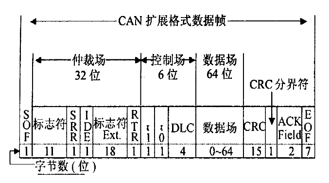
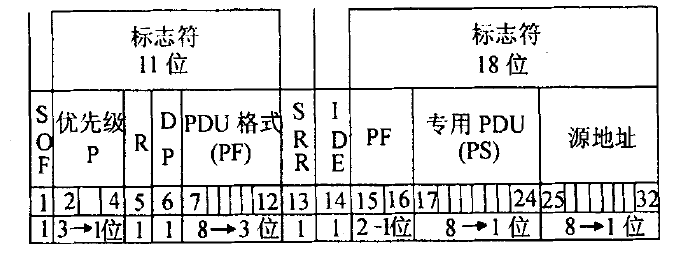

# 学习记录

## 相关

* 实验室：[visual  threat](https://www.visualthreat.com/index.action) 

  感觉很像看门狗中的主角。

* [奥迪车载娱乐系统漏洞分析](https://www.anquanke.com/post/id/107851)

  感觉有可能在实验机上复现，可以租车来复现该漏洞。

* 主要是 J1939 报文格式

## Can Bus 基础学习

https://www.zhihu.com/question/26962412 讲得比较一般，可以参考

https://zhuanlan.zhihu.com/p/32262127 可以参考学习CAN-bus 2.0 B 数据帧的格式

https://www.youtube.com/watch?v=FqLDpHsxvf8 can bus intro video

https://www.youtube.com/watch?v=LxtLiP9P6G0 J1939 intro video

CAN-bus系统数据传输过程：

（1）    准备数据——控制单元1准备数据，并提供给CAN控制器。

（2）    发送数据——CAN收发器接收数据，并将其转换为电信号发出。

（3）    接收数据——网络内其他控制单元都成为接收器，接收数据。

（4）    检测数据——每个控制单元检测接收到的数据以判断其是否是功能所需。

（5）    认可数据——控制单元如果判断数据是被需求的，则认可并处理数据，反之则忽略。

## CAN-bus2.0 B和J1939报文格式

> J1939基于CAN-bus系统，主要应用在车辆的电子部件之间的数据传输，其中包括对CAN网络物理层、数据链路层、应用层、网络层四个层的定义以及故障诊断和网络管理，最高可达到250Kbps的通讯速率。在J1939协议中，不仅仅规定了传输类型、分组结果、构、流量检测等，还定义了报文的具体内容。

### CAN2.0扩展格式

分为七段：

* 帧起始（SOF）：

  标识一个数据帧的开始，固定一个显性位。用于同步， 总线空闲期间的任何隐性到显性的跳变都将引起节点进行 硬同步。只有总线在空闲期间节点才能够发送SOF。

* 仲裁段（Arbitration Field）：

  仲裁段的内容主要为本数据帧的ID信息。数据帧分为标准格式和扩展格式两种，区别就在于ID信息的长度：标准格式的ID为11位；扩展格式为29位。在CAN协议中，ID决定着数据帧发送的优先级，也决定着其他设备是否会接收这个数据帧。

  * 仲裁段除了报文ID外，还有RTR, IDE, SRR位。

* 在控制段，

  r1（reserved1）和r0（reserved0）为保留位，默认设置为显性位。最主要的是DLC（Data Length Code）段，它是用二进制编码表示本报文中的数据段包含多少个字节。DLC段由4位组成，DLC3−DLC0，表示的数字为0-8.

* 数据段：

  数据帧的核心内容，有0-8个字节长度，由DLC确定。

* CRC段：

  为了保证报文的正确传输，CAN的报文包含了一段15位的CRC校验码，一旦接收端计算出的CRC码跟接收到的CRC码不同，就会向发送端反馈出错信息以及重新发送。CRC部分的计算和出错处理一般由CAN控制器硬件完成，或由软件控制最大重发数。

  在CRC校验码之后，有一个CRC界定符，它为隐性位，主要作用是把CRC校验码与后面的ACK段隔开。

* ACK段：

  包含确认位（ACK slot）和界定符（Delimiter,DEL）。ACK在发送节点发送时，为隐性位。当接收节点正确接收到报文时，对其用显性位覆盖。DEL界定符同样为隐性位，用于隔开。

* 帧结束段（End-of-Frame, EOF）：

  帧结束段由发送端发送7个隐性位表示结束。

### SAE J1939对仲裁场的改动

各个部分代表含义：

SOF : 起始位 

P （Priority）： 优先级 000 最高

R（Reserve）： 保留

DP（Data Page）：选择两页参数组中的一页，0包含现在被定义的所有报文，1页预备将来额外

PDU （Page Data Unit）：协议数据单元

SSR和IDE：隐性位，使得扩展帧的优先级低于标准格式数据帧的优先级

PF（Page Format）：识别被传送的两个PDU格式

PS：PDU专用，如果PF 的值在0 与239 之间(PDU1) , PS 场包含一个目的地址; 如果PF 的值在240 与255 之间(PDU2) , PS 场包含一个对PF的组扩展。组扩展提供更大的一组值以标识网络中能被广播的所有ECU 的报文。在J1939 标准下, 要被广播的大多数报文用PDU2 格式。用
PDU2 格式在网络中传输的数据不能被直接到达一个明确目的地。当报文必须要直接传送到一个专用ECU , 必须在PDU1 格式数的范围分配一个PGN (参数组数) , 以至于在报文标志符能包括一个专用的目的地址。

源地址：最后8 位包含ECU 传送报文的地址(源地址SA) 。对于一个给定的网络, 每一个
地址必须是唯一的, 两个不同的ECU 不能同时用同一个地址。

## **汽车总线通信状态监测与远程控制系统的设计与实现**——魏仁柱

通过汽车诊断工具（联网）获取CAN数据帧，从而达到控制ECU的目的。

### 本文贡献：

* 提出了攻击模型，联网汽车使用环境下使用恶意智能手机应用实现远程无线攻击。
* 提出了弥补CAN协议漏洞的安全协议。
* 利用ECU和CANoe分析了所提出的安全协议的安全性和性能。

> 联网汽车的组成部分：
>
> * 具有ECU和车载网络的车辆
> * 为车辆提供各种服务的入口
> * 连接车辆和接口的通信链路

### 车载CAN的三个主要漏洞

* 薄弱的访问控制
* 无加密
* 不进行身份验证

### 原因

车载网络是一个几乎无法进行访问控制的通信环境。

车载网络是基于发送者ID的多播广播环境，一个连接的节点可以接收发送的任何数据帧，所以恶意节点可以通过窃取正常节点的id来传输数据帧（数据帧的修改和重放攻击）。

广播通信的性质在车载网络中进行访问控制实际上是不可能的，因此需要加密和验证数据帧。

保密性：CAN中的每一个数据帧都应该被加密已提供保密性。

认证性：在can协议中，控制数据帧仅通过数据帧发送者的ID确认，可能导致存在重放攻击的可能。

### 实验过程

利用自诊断工具获得信息的过程：

1、利用自诊断工具连接到车辆的 OBD 2  接口
2、 在笔记本电脑连接到另一个外加的接口后，车载 CAN 总线数据就会被监测到。
3、 使用自诊断工具执行可以强制驱动确定的 ECU 的命令。

### 防御

#### 设计目标

* 身份验证技术
* 高效的密钥管理

#### 提供的安全协议

加密

### 相关

EVITA开发了用于车载网络的安全的硬件安全模块HSM，根据使用的领域不同，HSMs分为三种类型。

* 适用于车辆网络（内部）的全HSMs
* 适合于汽车内部网络的中型HSMs
* 适用于传感器和执行器的轻型HSMs

## **CAN-bus协议逆向分析系统的设计与实现**——陈秋言

介绍了J1939，CANalyst-2 分析仪。

CAN-bus网络传输示教板，分析舒适总线部分，采用周立功 CAN pro 来采集数据。

控制变量法来分析，每个数据帧对应的ECU。